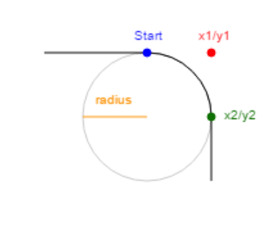

# 2021.01.14 자바스크립트 스터디 발표 자료


### fetch()란?
fetch 매서드는 JavaScript에서 서버로 네트워크 요청을 보내고 응답을 받을 수 있도록 해주는 매서드이다.
XMLHttpRequest와 비슷하지만 fetch는 Promise를 기반으로 구성되어 있어서 더 간편하게 사용할 수 있다는 차이점이 있다.

### XMLHttpRequest란?
대부분의 웹 브라우저에서는 서버로부터 데이터를 요청하는 XML 객체들을 내장하고 있다.

이름만 보면 XML 데이터만 다룰 수 있을 것 같지만 모든 데이터를 다룰 수 있으며, AJAX 프로그래밍에서 주로 사용한다.

XMLHttpRequest를 이용하면 웹 페이지를 전부 로딩하고도 서버로부터 데이터를 요청하거나 전송받을 수 있으며, 웹 페이지를 전부 로딩하지 않고도 일부만을 갱신하는 게 가능해진다.
다시 본론으로 돌아가보자.
### fetch()의 기본 구조
```js
fetch('http://example.com/movies.json')
  .then(function(response) {
    return response.json();
  })
  .then(function(myJson) {
    console.log(JSON.stringify(myJson));
  });
```

위 코드를 해석하면 네트워크에서 JSON파일을 가져와 콘솔에 인쇄하는 것이다.
fetch()는 쉽게 말해 url(가져올 자원의 경로)를 가져오고 응답을 포함하는 response객체를 반환한다.
만약 reponse 객체로부터 사진을 가져오기 위해서는 json메서드를 사용해야한다.
### 요청 정보 파라미터
```js
fetch(url, {
   method: 'post',
   headers: {
     "Content-type": "application/x-www-form-urlencoded; charset=UTF-8"
   },
   body: 'foo=bar&lorem=ipsum'
})
.then(res => {
  console.log(res);
})
.catch(error => console.log(error));
```
method : HTTP method와 동일하며 요청 방식을 나타낸다. (GET, POST, PUT, DELETE 등)

headers : 요청 헤더에 대한 정보를 나타낸다.

body : 요청을 보내는 데이터를 나타낸다. 여러 가지 자료형을 대입할 수 있다.

### request()란?


# Canvas
canvas는 웹 페이지에 그래픽을 그리게 해주는 방법이다.
```js
const canvas = document.querySelector("canvas");
const context = canvas.getContext("2d");
```
canvas에 요소를 그리려면 getContext()를 사용하여 정의를 해야한다. 기본적으로 2d로 정의가 된다.

- beginPath(); 도형을 그리기 전에 지정해줌

- closePath() : 도형의 시작점과 끝 점 사이에 직선을 그어 완성된 도형으로 만들어줌

- fill() : 주어진 도형의 path를 채워줌 use with fillStyle

- moveTo() : 선을 그리지 않고 좌표를 이동시킨다.

- stroke() : 윤곽선을 이용하여 선을 그을 수 있게 해준다.

- strokeStyle : 윤곽선의 스타일을 지정해준다.

- lineTo(x, y) : 현재 위치에서 지정핸 위치까지 선을 그린다.


그 외 별개로 다른 도형들도 있지만 예시로 원과 사각형이 있다.
### 원

- arc(x, y, radius, startAngle, endAngle, direction) : 원을 그려줌

⇒ 주의할 점 startAngel 및 endAngle은 x * Math.PI를 통해 지정해 주어야 하며 direction 의 경우 clockwise 또는 anticlockwise로 지정해 주어야 함

- context.arcTo(x1,y1,x2,y2,r) : 곡선을 그릴 수 있게 됨


### 사각형
- fillRect(x, y, width, height) : 안이 채워진 사각형을 만들어준다.

- strokeRect(x, y, width, height) : 윤곽선이 채워진 사각형을 만들어준다.

- clearRect(x, y, width, height) : 부모 요소의 채워진 사각형에서 지정한 부분 만큼을 지워준다.

- fillstyle () : 사각형 영역을 채울 색상을 설정함. 색상값만을 사용할 수도 있고, 투명도까지 명시할 수 있음.

# HTMLCanvasElement.toDataURL() 
 
 매개변수에 지정된 이미지(기본 .png)의 URL을 반환해준다.

Canvas 요소가 주어지면
```js
<canvas id="canvas" width="5" height="5"></canvas>
```
```js
var canvas = document.getElementById('canvas');
var dataURL = canvas.toDataURL();
console.log(dataURL);
// "data:image/png;base64,iVBORw0KGgoAAAANSUhEUgAAAAUAAAAFCAYAAACNby
// blAAAADElEQVQImWNgoBMAAABpAAFEI8ARAAAAAElFTkSuQmCC"
```
이렇게 CANVAS의 데이터 URL을 가져올 수 있다.